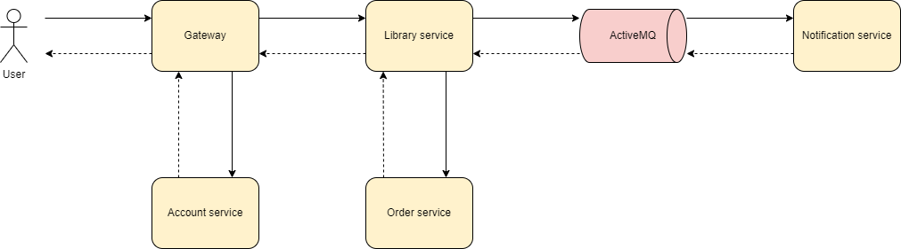
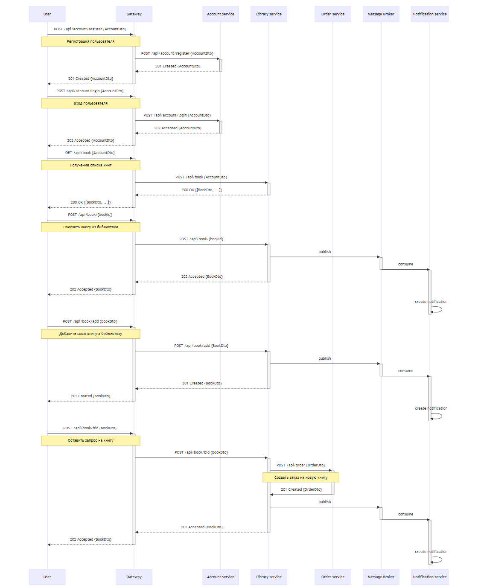

# Библиотека электронных книг с использованием микро-сервисной архитектуры

## Пользовательские сценарии:
- Пользователь регистрируется в личном кабинете.
- Пользователь выполняет вход в личный кабинет.
- Пользователь запрашивает список книг, доступных в библиотеке.
- Пользователь выбирает книгу, которую возьмет в библиотеке.
  - Книга резервируется за пользователем, направляется уведомление о получение книги.
- Пользователь загружает свою книгу в библиотеку, библиотека пополняется.
 - Книга добавляется в библиотеку, направляется уведомление с благодарностью.
 - Книга не добавляется (дубликат), направляется уведомление с информацией.
- Пользователь не находит интересующею книгу и оставляет запрос на пополнение библиотеки.
  - Книга добавляется в лист ожидания, направляется запрос в отдел закупок.

- Администратратор выполняет вход в личный кабинет.
- Администратратор может блокировать учетную запись пользователя
- Администратратор может удалить книгу из библиотеки.
- Администратратор может удалить книгу из листа ожидания. 

## Схема взаимодействия сервисов:

## Назначение сервиса и его зона ответственности:
- Gateway
  - Выполняет проверку, что пользователь авторизирован.
- Account service
  - Выполняет регистрацию и авторизацию пользователей.
- Library service
  - Основной back-end. Является головным хранилищем книг и выполняет выдачу книг пользователям.
- Order service
  - Выполняет создание заказа на пополнение библиотеки.
- Notification service
  - Выполняет отправку уведомлений на электронную почту пользователям.

## Контракты взаимодействия (Sequence диаграмма):
