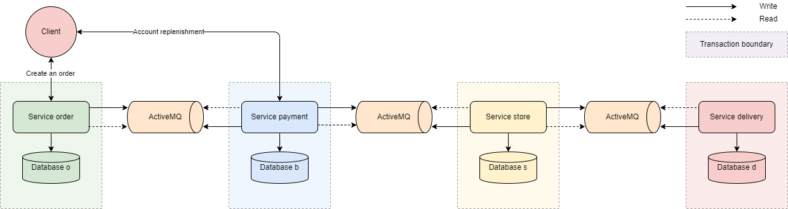

## Сценарий:

- Положить деньги на счет пользователя через сервис "Платеж".
- Сделать заказ.
- Сервис "Платеж" должен подтвердить, что платеж прошел
- Сервис "Склад" должен зарезервировать конкретный товар на складе.
- Сервис "Доставка" должен зарезервировать курьера на конкретный слот времени.
### Условия:
- Если хотя бы один из пунктов не получилось сделать, необходимо откатить все остальные изменения.
- Для отката в сервисе "Платеж" оформлять заказ на большую сумму, чум есть на балансе.
- Для отката в сервисе "Склад" оформлять заказ с описанием 'Rollback transactions in the Store service'
- Для отката в сервисе "Доставка" оформлять заказ с описанием 'Rollback transactions in the Delivery service'

## Хореография SAGA (Хореография с двойной записью)

Выбран подход для реализации: закоммитить транзакцию и затем отправить сообщение - остается возможность
падения приложения после коммита транзакции и перед отправкой сообщения.
Однако данное решение лучше, поскольку можно задизайнить приложение таким образом,
чтобы выполнялись ретраи

[Источник](https://habr.com/ru/articles/769102/)

### Схема взаимодействия сервисов:
